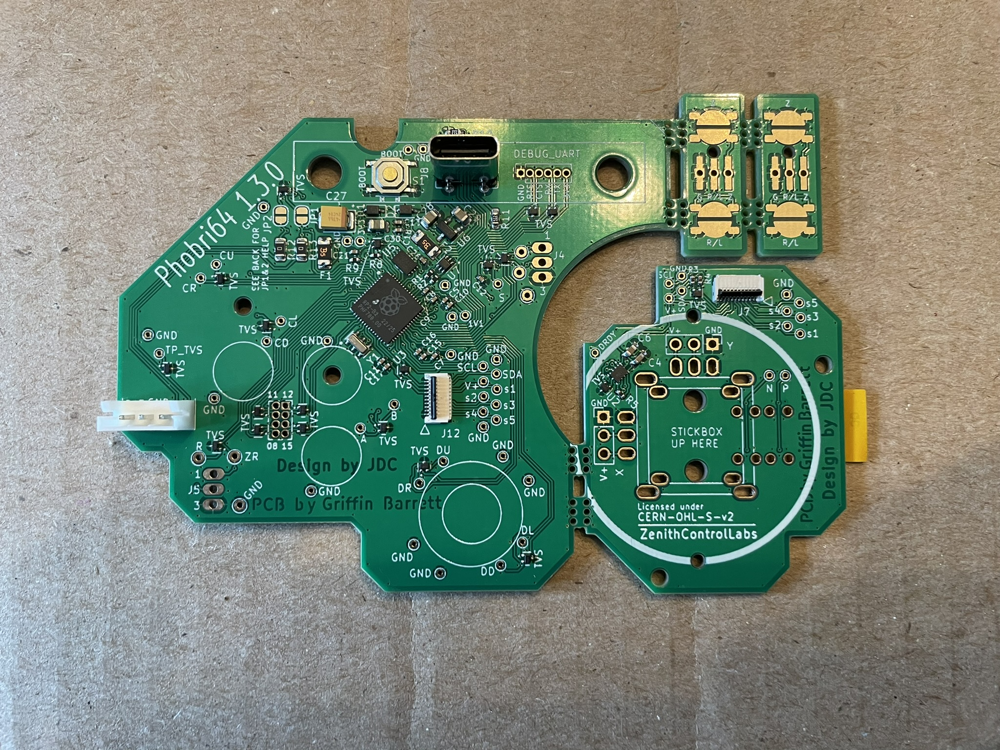

This guide assumes you have followed the [ordering guide](./Ordering_Guide.md) and have the following parts to assemble the controller:

* 1x Phobri64 board (incl mainboard & stickboard)
* 2x trigger boards and 2x wires to connect them
* 1x stick module
* 1x FFC cable

I also assume you are comfortable taking apart a stock Hori, and have some familiarity with soldering. If soldering is new to you, I  highly recommend following [this part of the PhobGCC guide](https://github.com/PhobGCC/PhobGCC-doc/blob/main/For_Makers/Build_Guide_2.0.md#soldering-interlude) for some solid general advice. It also includes some discussion on what tools to buy for soldering, if you have not already purchased them. I assume you have all of these tools.

# Board Prep

The board should come from the factory like this:

You will want to separate the mainboard, the stickboard, and the two trigger boards from each other. They are connected by "mousebites" (highlighted below), small pieces of PCB with holes drilled in them so they can be snapped off by hand. You will need to use some force to snap them, but be gentle and make sure to apply pressure only where the holes are themselves; you don't want to break the non-mousebite part of the board.

If you have some pieces hanging off like this, I recommend using pliers to snap them off. 

When you are done, it should look like this.

# Loading firmware

Now is a good time to load the initial firmware. Download the latest firmware [from here](https://github.com/ZenithControlLabs/Zenith_FW/releases). You want the UF2 with "Phobri64" in the name. Next, hold the "S1" button on the board, and plug in a USB-C cable from your computer to the adjacent connector, as shown:

The board should show up as a flash drive named "RPI-RP2" on your computer. Simply drag and drop the UF2 you downloaded to this drive. The board will reboot. Test that it is working ok by visiting [the configuration website](https://zenithcontrollabs.github.io/Zenith_FW/web/platforms/phobri64/). It should show up in the list of devices when you hit 'connect controller'. No signal will show up, but this is fine because you have not connected the stickboard. Make sure to unplug it for the rest of this guide.

# Soldering the stick module

## 16mm stickbox prep

([skip this](#soldering) if you are using the stick module exactly as it comes, with the 13mm stickbox)

If you are using a 16mm stickbox, either the replacement or the original Hori one, you will need some extra steps. First, if you have not already, take off the potentiometers on whatever you are using, so that you end up with a bare stickbox that looks like this.

Take the sensors off of whatever module you are harvesting them from. For example, in the picture below, on the left is a Hallpi module as it comes, and the 2 blue plastic pieces on the right are the sensors you are going to reattach, harvested from the same type of module.

Regardless of what module you are using, you will have a plastic nub in the bottom left corner of the sensor housing (highlighted.) Remove this piece using flush cutters. If you don't have them, you can use scissors, though it may be a lot harder to get it flat.

From another angle:

Attach the trimmed sensors to the 16mm stickbox. It should look like this when you are done.

## Soldering

At this point it is assumed you have a complete module with sensors attached. Drop the module into the board. Make sure to insert it on the right face, like so:

Solder the legs first in a cross pattern, making sure that the stickbox remains flat and flush to the board, otherwise it will be soldered crooked. You should have the stickbox side of the board down and the joint side up, so you will have to hold the stickbox in place with your finger or some device to make sure it is flat. Use a healthy amount of solder as these are structural joints, it is important that the joint is not poorly attached.

*disclaimer: I am by no means an expert at soldering; my setup to stabilize the board is probably not the best, and it's rather uncomfortable anyway. Try whatever works and is comfortable for you to solder and keep the stickbox stabilized. Just don't flip the board because the joints should not be soldered on that side.*

Next, solder the sensors, highlighted in blue below. You can skip soldering the button pins (in red), if you think you might desolder it later and want to save some time. The button click doesn't do anything on Phobri anyway. 

# Soldering the trigger boards

Grab your 2 3-pin wires for connecting the boards. If you are cutting them yourself instead of sourcing the wires from a donor Hori, they need to be about 70mm in length. I recommend starting by soldering the wires into the trigger boards. The wires are going into the side with the pads on it. So, you should feed them through the opposite side and solder on the side with the pads.

Next, solder the wires into the mainboard. The wires should be coming out of the top side where all the components are. Be very careful to match the two pinouts! The pin 3 is ground on the mainboard, pin 1 is Z (future versions will have this written directly on a silkscreen). The stickboard has the signal names silkscreened, so it should be easy to match there.

# Final assembly

Connect the two boards with the FFC cable by flipping up the small black piece and inserting it into the connector like so:

The orientation of the cable is important. There is a blue tab to keep track of the orientation. It should be inserted into the two connectors like this:

(notice the bend in the cable; so if the cable did not flip, like it will be once assembled, the stickboard would be upside down how it is in the picture.)

The boards are now ready, and you can reassemble your controller as you would a stock Hori. Make sure to 

* Put the plastic housings with the button pads on the trigger boards (you can take these off the trigger boards of the hori you are using for the rest of your parts). Take note of the plastic nub in the housing; this needs to match the orientation where the hole in the trigger boards is.
* Put the stick cap on the stickbox.
* Reconnect the 3-pin N64 controller wire into the header.

When it is all done:

# Next steps

Proceed to the [Usage Guide](./Usage_Guide.md) for calibration, settings info, etc.

