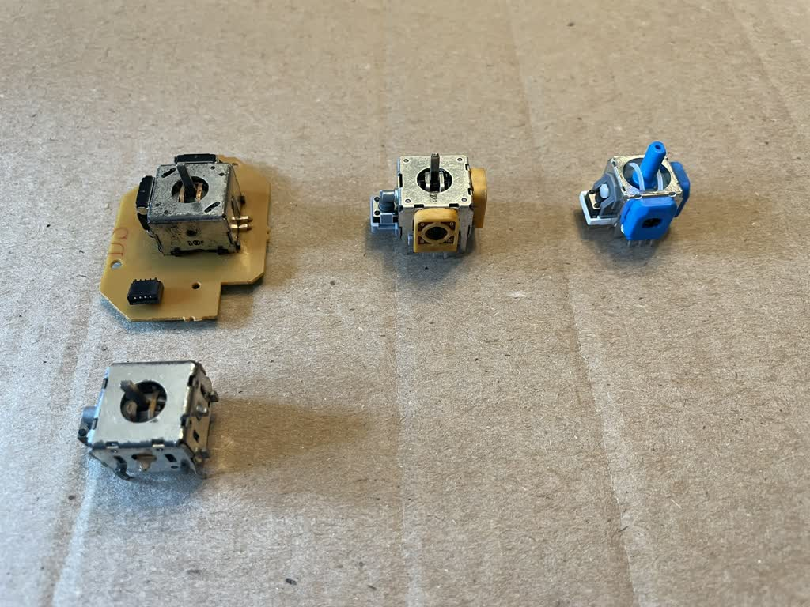

# Required Parts 

For build:
* 1x Phobri64 board (incl mainboard & stickboard)
* 2x trigger boards and 2x wires to connect them
* 1x stick module
* 1x FFC cable

While calibrating:
* 1x USB-C cable.

For now, the gerbers published for the Phobri64 PCB come with a set of 2 trigger boards as well. But, these trigger boards are interchangeable with the ones on a stock Hori, if you would like to use those instead. 

# Obtaining the boards

The boards are bought directly from our PCB house of choice, Elecrow. Luckily, Elecrow has a project sharing system to spare you from having to upload the gerbers, BOM, etc. yourself. Head over to [our project webpage on Elecrow](https://www.elecrow.com/sharepj/phobri64-875.html). All you need to do (after creating an account at Elecrow) is hit the add to cart button; a menu will pop up with a bunch of parameters. Leave them as is (these are not just the defaults, they have been chosen explicitly by me.) **The only thing you need to change is the PCBA quantity, unless you plan to assemble the PCBs yourself.** This will save you money but means placing all the components on the board and soldering them yourself with a reflow oven or something similar, which is out of reach for most people. So, in general, you should just have them assembled (set PCBA quantity = PCB quantity.) Also, note that elecrow has a minimum order quantity of 5. 

> [!IMPORTANT]
> TL;DR Go to https://www.elecrow.com/sharepj/phobri64-875.html; hit add to cart; set PCB and PCBA quantity to the same number, however many boards you want (minimum 5.)

# Stick module

A stick module includes a _stickbox_, the moving parts without a sensor, and the _sensors_, which clip onto the side of it and are soldered into the points on the board. Usually they are sold together, but you will probably want to mix and match a stickbox with some other sensors,  depending on your preference. Links for recommended parts are provided and then explanations/recommendations for them are given separately.

## Product Links

> [!IMPORTANT]
> Make sure that, whatever module you buy, it is **PS5/DualSense compatible**. PS4, PS5, Xbox, etc. controllers all have different pinouts for the sensors; AliExpress sellers make different module variants for each. Pay close attention to what you are buying! PS4, Xbox, etc. modules will **not work** in Phobri64!

> [!TIP]
> If you want to try a module not listed here, check out [this YouTube channel](https://www.youtube.com/@metalplasticelectronics354) for comprehensive reviews. Oriented towards PlayStation/Xbox audience (so no testing of notches & etc.), but still helpful.

* #### [16mm Hori Stickbox Replacement](https://www.aliexpress.us/item/3256805206186879.html)
* #### [Hallpi TMR modules](https://www.aliexpress.us/item/3256808409603542.html)   
    (Color: For PS5)
* #### [Ginfull TMR modules](https://www.aliexpress.us/item/3256808341019285.html)
    (Color: A)
* #### [Ksilver TMR modules](https://www.aliexpress.us/item/3256808526199837.html)
    (Color: 2pcs for PS5)
* #### [Favor Union Halls](https://www.aliexpress.us/item/3256807054606533.html)
    (Color: PS5-2pcs)
* #### [Increased height stick caps](https://www.amazon.com/dp/B08GCP53V4?ref=ppx_pop_mob_ap_share)

> [!TIP]
> TL;DR for below: if you want a standard Hori experience with the original stick cap but on hall/tmr sensors, get the [16mm Hori Stickbox Replacement](#16mm-hori-stickbox-replacement) and swap the sensors with the [Hallpi modules](#hallpi-modules) according to the build guide.   

## 16mm vs 13mm 

The standard Hori stickbox is 16x16mm. Almost all newer controllers use a 13x13mm (or sometimes 12mm) sized stickbox, which is also shorter by 1mm. They also almost always have a square shaft, unlike the original Hori stickbox. There is a [form factor compatible replacement for the original](#16mm-hori-stickbox-replacement). The image below shows the differences between the original, the replacement, and an example of a newer stick in the 13x13mm form factor.

<figure class="image">
  
  <figcaption>Left: Hori stickboxes (two variants, top w/o click button and in the board, bottom w/ click button.) Center: 16mm replacement stickbox. Right: 13mm stickbox (Hallpi). </figcaption>
</figure>

Phobri64 is compatible with all of them. However, the Hori stick cap is **not compatible** with the square shaft of the newer stickboxes. For now, if you would like to use the original cap, you must **desolder an original Hori stickbox, or use the [16mm replacement](#16mm-hori-stickbox-replacement).**

Since all the new controllers use the 13mm size, unfortunately that means basically all the hall modules have sensors fitted to that form factor. Luckily, they can be relatively easily modded to fit to the side of the 16mm stickbox by clipping off a piece of plastic. The build guide has instructions for this.

If you would like to use the 13mm stickbox instead, with a non-stock cap, you will need to take care of the height difference of the stickbox and most caps. I don't have exact measurements, but I'd recommend getting a set of [various height stick caps](#increased-height-stick-caps) and selecting one that works nicely for you.

## Sensor comparison

There are two main types of magnet-based sensors used: Hall and TMR. TMRs have risen in popularity lately due to their lower noise, although they are a bit more expensive.

I present a list of sensors I've tried and recommend, evaluated on a couple metrics:

* Noise: How noisy is the signal (does it jitter and shake etc.)
* Pressure sensitivity: How much does pressing in the stick vertically (especially at the notches on the horizontal axis) affect the signal. And in what direction. This is a function of the stickbox of course but also the sensor.
* Hysteresis behavior: when you go from say left notch to up left notch versus up notch to up left notch, how consistent is the notch angle achieved. This is a function of both the electronics and the physical design of the stickbox. When I say "the hysteresis is worse/better" I mean it is less or more consistent respectively.
* Cost.

In this sensor comparison, I'm assuming the complete module is used, so the sensor is paired with the stickbox it comes with. AFAIK, there is not a big difference between the stickboxes of the various modules, but there is a big difference between those stickboxes and the 16mm one, which [I explain below](#stickbox-influence).

* [Hallpi TMR](#hallpi-tmr-modules) sensors are the best all around, although they are a bit on the expensive side. 
    * hysteresis: these perform the best w.r.t hysteresis from my testing, there is basically none.
    * noise: best I've tested
    * pressure sensitivity: relatively low sensitivity, but the x-values *decrease* when you press in, while most other sensors increase. If you're pressing in fully on the right notch, I've observed a decrease in values from 85 to about 77. Normally not bad enough to make e.g. mario stop running, but if you get a particularly bad sensor or you're playing a different game it's something to be aware of.

> [!NOTE]
> You may see listings for GulliKit TMR modules. These are identical to Hallpi, they are produced in the same factory with different branding. GulliKits are more expensive because of the stick cap they include.

* [Ginfull TMR](#ginfull-tmr-modules) sensors are the cheapest TMRs, but are a bit worse than the hallpis in all other characteristics. They have some hysteresis, a bit more pressure sensitivity (although it increases values instead of decreases) and noise than the hallpis. 

* [Ksilver TMR](#ksilver-tmr-modules) sensors are similar to the Hallpis. The pressure sensitivity is a bit better. Similar lack of hysteresis. They have odd behavior where the values drift for a bit randomly and then return to normal. (Hallpis also have this but it's less pronounced and seems to happen more when you're moving it around a lot.) One thing is you won't be able to use these modules on any other stickbox, the magnet is part of the stickbox assembly. The stock stickbox is also relatively loose.

* [Favor Union Halls](#favor-union-halls) I would say are the best in class for Hall sensors. They are cheaper than all of the TMRs. Noisier than the TMRs as expected. Signal might respond slightly faster? Have not evaluted scientifically. No data on the hysteresis at the moment, I don't currently have a controller with them. You also can't use the modules on a non-favor union stickbox, they use a different mounting mechanism for the magnet. You can combine the sensors with something like a Ginfull magnet though. 

### Stickbox influence 

As mentioned, the stickbox influences a number of things in the sensor performance. Generally, these are the things to know:

* From informal testing, the 16mm stickbox appears to make the hysteresis problem slightly worse across the board, regardless of sensor.
* The 16mm stickbox also seems to be slightly worse for the pressure sensitivity across the board. The stickbox is not very well designed to stabilize the x-axis shaft when it is pressed in.

# Remaining parts

* FFC cable:
    * You want **10 pins, 50mm length, 0.5mm pitch, B type.**
    * [AliExpress](https://www.aliexpress.us/item/3256806969799753.html)
* Trigger board wire (if you are not taking one from a stock hori)
    * 3 wires going from the mainboard to trigger board.  Anything you can find in roughly 22-26awg is fine (in practice it kind of depends on how thick the individual strands are though). The through hole on the board for the wires is about 1mm.
    * I've bought the [4-pin variant of this](https://www.aliexpress.us/item/3256806969799753.html) because it's cheap and it's the only listing with more than 2 pins that seems to have ground/black on the outside. It works but if you accidentally take off too many strands taking off the insulation, it can leave the connections a little brittle.
    * There are also real ribbon cables like the ones in the hori. These are a lot more durable. [This one off Mouser](https://www.mouser.com/ProductDetail/KYOCERA-AVX/902220736003000?qs=7tvpBpzVbup6XfIuE3jShQ%3D%3D) is good, but a little frustrating to work with as it's hard to get the wires twisted right to fit into the hole. Tinning them tends to make the wire too big.
    * I am still looking for better solutions here. Please let me know on the discord if you find something nice! Or raise an issue here on the github.
