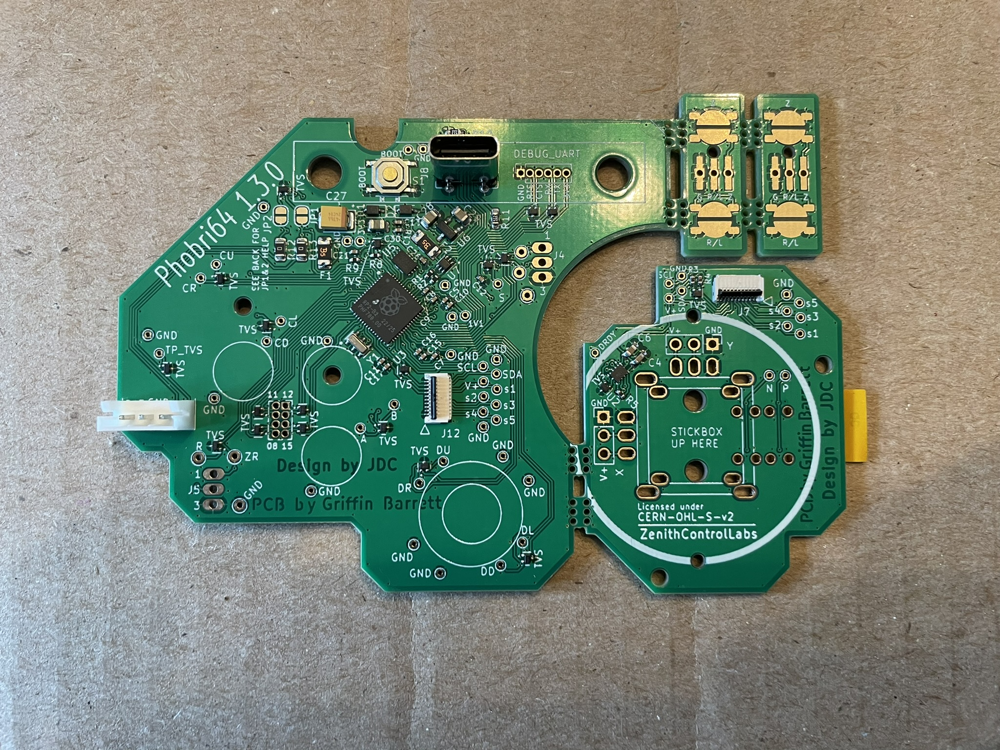

# DISCLAIMER: DO NOT RECOMMEND ORDERING! BETTER OPTIONS COMING SOON. CHECK [DISCORD ANNOUNCEMENT](https://discord.com/channels/1050259430182244404/1126933099335389256/1413663604263227402) FOR MORE DETAILS (INVITE BELOW).

# Phobri64

## [Community Discord](https://discord.gg/pXuuHDnCx4)

Phobri64 is a custom PCB aiming to bring software calibration and configurability to Hori Pad Mini 64 controllers, à la [PhobGCC](https://phobgcc.com). It is compatible with Hall effect sensors, through compatibility with the existing modules available for DualSense controllers.

Start here:

## [Ordering Guide](./Ordering_Guide.md)

## [Build Guide](./Build_Guide.md)

## [Usage Guide](./Usage_Guide.md)

## [Debug Guide](./Debug_Guide.md)
